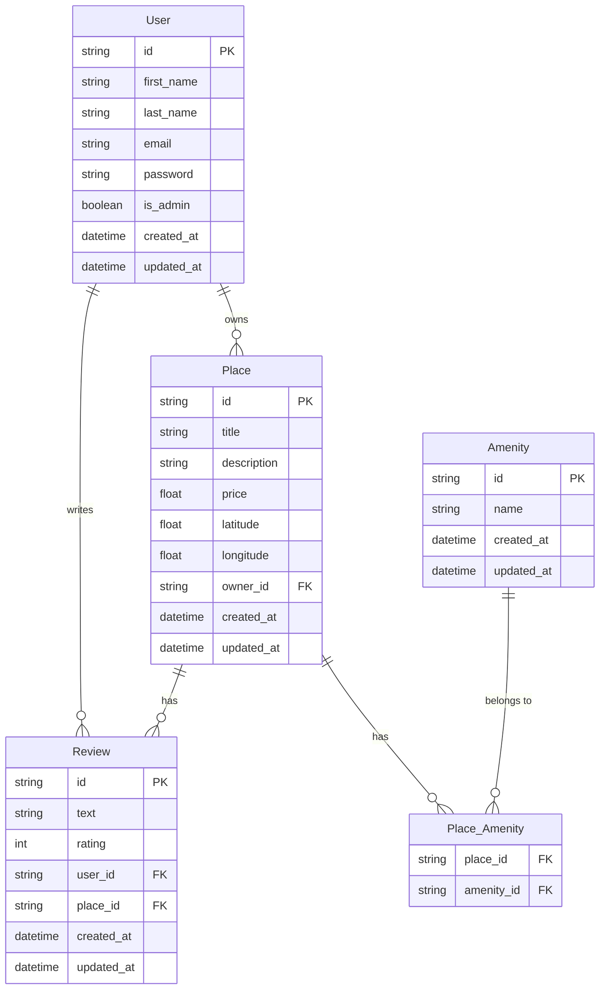

# HBnB Database — Entity-Relationship Diagram

## ER Diagram

## Relationships

| Relation | Type | Description |
|----------|------|-------------|
| User → Place | One-to-Many | Un utilisateur peut posséder plusieurs places |
| User → Review | One-to-Many | Un utilisateur peut écrire plusieurs reviews |
| Place → Review | One-to-Many | Une place peut avoir plusieurs reviews |
| Place ↔ Amenity | Many-to-Many | Via la table d'association `Place_Amenity` |

## Constraints

- `User.email` : **UNIQUE** — pas de doublons
- `Review (user_id, place_id)` : **UNIQUE** — un user ne peut reviewer une place qu'une seule fois
- `Place_Amenity (place_id, amenity_id)` : **Composite Primary Key**
- `Review.rating` : **CHECK** entre 1 et 5
